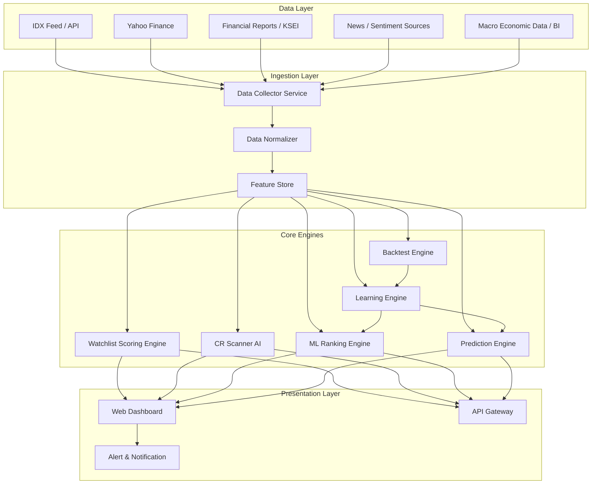
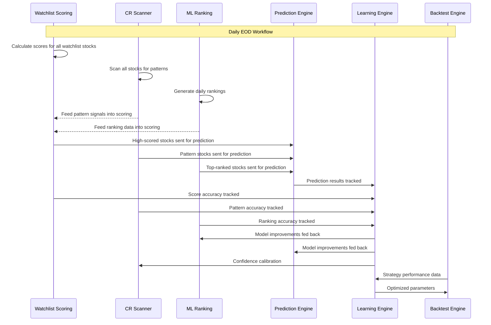

# AlphaHunter IDX — Product Requirements Document (PRD)

> **Version**: 1.0.0  
> **Status**: Draft  
> **Created**: 2026-06-05  
> **Author**: AlphaHunter IDX Team  
> **Target Market**: Bursa Efek Indonesia (IDX)

---

## Table of Contents

1. [Executive Summary](#1-executive-summary)
2. [Problem Statement & Market Context](#2-problem-statement--market-context)
3. [Product Vision & Goals](#3-product-vision--goals)
4. [System Architecture Overview](#4-system-architecture-overview)
5. [Data Pipeline & Sources](#5-data-pipeline--sources)
6. [Module 1 — Watchlist Scoring Engine](#6-module-1--watchlist-scoring-engine)
7. [Module 2 — CR Scanner AI](#7-module-2--cr-scanner-ai)
8. [Module 3 — ML Ranking Engine](#8-module-3--ml-ranking-engine)
9. [Module 4 — Prediction Engine](#9-module-4--prediction-engine)
10. [Module 5 — Learning Engine](#10-module-5--learning-engine)
11. [Module 6 — Backtest Engine](#11-module-6--backtest-engine)
12. [Cross-Module Integration](#12-cross-module-integration)
13. [IDX Market Specifications](#13-idx-market-specifications)
14. [Tech Stack & Infrastructure](#14-tech-stack--infrastructure)
15. [Data Models & Schema](#15-data-models--schema)
16. [API Contract](#16-api-contract)
17. [Non-Functional Requirements](#17-non-functional-requirements)
18. [Risk Analysis & Mitigations](#18-risk-analysis--mitigations)
19. [Implementation Roadmap](#19-implementation-roadmap)
20. [Success Metrics & KPIs](#20-success-metrics--kpis)
21. [Appendix](#21-appendix)

---

## 1. Executive Summary

**AlphaHunter IDX** adalah platform analisis saham berbasis AI yang dirancang khusus untuk pasar Bursa Efek Indonesia (IDX). Platform ini mengintegrasikan enam engine utama yang bekerja secara sinergis untuk memberikan insight investasi yang actionable bagi trader dan investor di pasar saham Indonesia.

### Architecture Overview

```
┌─────────────────────────────────────────────────────────────────────┐
│                        AlphaHunter IDX                              │
│                                                                     │
│  ┌──────────────┐  ┌──────────────┐  ┌──────────────────────────┐  │
│  │  Watchlist    │  │  CR Scanner  │  │    ML Ranking Engine     │  │
│  │  Scoring      │◄─┤  AI          │──►│  (Daily Top Picks)       │  │
│  │  Engine       │  │  (Pattern    │  │                          │  │
│  │              │  │   Detection) │  └────────┬─────────────────┘  │
│  └──────┬───────┘  └──────┬───────┘           │                    │
│         │                 │                    │                    │
│         ▼                 ▼                    ▼                    │
│  ┌──────────────────────────────────────────────────────────────┐  │
│  │                   Prediction Engine                          │  │
│  │           (Price Movement & Trend Forecasting)               │  │
│  └──────────────────────────┬───────────────────────────────────┘  │
│                             │                                      │
│         ┌───────────────────┼───────────────────┐                  │
│         ▼                                       ▼                  │
│  ┌──────────────┐                        ┌──────────────┐          │
│  │  Learning    │                        │  Backtest    │          │
│  │  Engine      │◄──────────────────────►│  Engine      │          │
│  │  (Adaptive   │                        │  (Strategy   │          │
│  │   Feedback)  │                        │   Validation)│          │
│  └──────────────┘                        └──────────────┘          │
└─────────────────────────────────────────────────────────────────────┘
```

### Value Proposition

| Aspek | Tanpa AlphaHunter | Dengan AlphaHunter |
|-------|-------------------|--------------------|
| Stock Screening | Manual, 800+ emiten | AI-scored, top-ranked otomatis |
| Pattern Recognition | Subjektif, rawan bias | Computer vision, objektif |
| Prediksi Pergerakan | Feeling-based | Data-driven ML models |
| Evaluasi Strategi | Trial-and-error real money | Backtesting historical data |
| Continuous Learning | Statis | Adaptive feedback loop |

---

## 2. Problem Statement & Market Context

### 2.1 Problem Statement

Investor ritel di Indonesia menghadapi tantangan berikut:

1. **Information Overload**: 800+ emiten terdaftar di IDX dengan beragam sektor, sulit menyaring secara manual
2. **Bias Kognitif**: Keputusan investasi sering didasarkan emosi, bukan data
3. **Keterbatasan Alat Analisis**: Mayoritas platform existing tidak didesain khusus untuk karakteristik pasar IDX (auto-rejection, tick size, lot size, settlement T+2)
4. **Minimnya Backtesting**: Trader retail jarang memvalidasi strategi sebelum deploy capital
5. **Kurangnya Adaptive Learning**: Strategi yang tidak dievaluasi cenderung mengulang kesalahan

### 2.2 Market Context — IDX Characteristics

| Parameter | Nilai | Keterangan |
|-----------|-------|------------|
| Jumlah Emiten | ~900 | Per 2026, terus bertambah |
| Jam Perdagangan | 09:00 – 12:00, 13:30 – 15:00 WIB | Sesi 1 & 2 |
| Settlement | T+2 | 2 hari kerja setelah transaksi |
| Lot Size | 100 lembar | Minimum pembelian |
| Tick Size | Bervariasi per harga | Rp 1, 2, 5, 10, 25, 50 |
| Auto Rejection | ±20% s/d ±35% | Tergantung harga saham |
| Foreign Ownership Limit | Bervariasi per emiten | Max 49-80% tergantung sektor |

### 2.3 Target Users

| Persona | Deskripsi | Kebutuhan Utama |
|---------|-----------|-----------------|
| **Swing Trader** | Holding 3-14 hari, fokus momentum | CR Scanner, Prediction Engine |
| **Position Trader** | Holding 1-6 bulan, fokus trend | ML Ranking, Watchlist Scoring |
| **Investor Fundamental** | Holding > 6 bulan | Watchlist Scoring, Backtest |
| **Quant Enthusiast** | Algorithmic approach | Backtest Engine, Learning Engine |

---

## 3. Product Vision & Goals

### 3.1 Vision Statement

> *"Menjadi platform analisis saham berbasis AI paling komprehensif dan akurat untuk pasar Indonesia, yang membantu investor membuat keputusan investasi berbasis data secara konsisten."*

### 3.2 Strategic Goals

| # | Goal | Target | Timeline |
|---|------|--------|----------|
| G1 | Menghasilkan stock screening accuracy > 65% | Hit rate winning trades | Q4 2026 |
| G2 | Menyediakan backtesting dengan data IDX 10+ tahun | Historical depth | Q2 2027 |
| G3 | Mengurangi average loss per trade user | < 5% avg loss | Q4 2027 |
| G4 | Membangun adaptive model yang membaik seiring waktu | Model improvement > 2% p.a. | Ongoing |

### 3.3 Design Principles

1. **IDX-First**: Semua fitur dirancang berdasarkan aturan dan karakteristik BEI
2. **Transparency over Black-box**: Setiap rekomendasi harus memiliki penjelasan (explainable AI)
3. **Speed**: Real-time atau near-real-time processing untuk data intraday
4. **Modularity**: Setiap engine harus bisa beroperasi independen dan terintegrasi
5. **Regulatory Compliance**: Tidak memberikan saran investasi langsung, melainkan analytical tools

---

## 4. System Architecture Overview

### 4.1 High-Level Architecture



### 4.2 Data Flow Pipeline

```
Raw Data Sources
      │
      ▼
┌──────────────────┐
│  Data Collector   │  ── Scheduled jobs (EOD, Intraday, Weekly)
│  (Ingestion)      │
└────────┬─────────┘
         │
         ▼
┌──────────────────┐
│  Data Normalizer  │  ── Cleansing, corporate action adjustment
│  & Enrichment     │     (stock split, rights issue, dividen)
└────────┬─────────┘
         │
         ▼
┌──────────────────┐
│  Feature Store    │  ── Pre-computed technical indicators
│  (Time-Series DB) │     fundamental ratios, sentiment scores
└────────┬─────────┘
         │
    ┌────┼────┬────────┬──────────┬──────────┐
    ▼    ▼    ▼        ▼          ▼          ▼
   E1   E2   E3       E4         E5         E6
```

---

## 5. Data Pipeline & Sources

### 5.1 Data Sources

| Source | Data Type | Frequency | Method | Priority |
|--------|-----------|-----------|--------|----------|
| **IDX API / Feed** | OHLCV, order book | Real-time / EOD | WebSocket / REST | P0 |
| **Yahoo Finance** | Historical OHLCV | EOD | yfinance library | P0 |
| **IDX Website** | Emiten profiles, corporate actions | Daily | Web scraping | P0 |
| **KSEI** | Foreign ownership, settlement | Daily | API / Scraping | P1 |
| **Bank Indonesia** | BI Rate, inflasi, kurs | Monthly | REST API | P1 |
| **BPS** | GDP, ekonomi makro | Quarterly | REST API | P2 |
| **News Portals** | Berita korporasi, sentiment | Real-time | RSS / NLP scraping | P1 |
| **Laporan Keuangan** | Financial statements | Quarterly | PDF parser / API | P0 |
| **IDX Composites** | IHSG, LQ45, IDX30 | Real-time / EOD | API | P0 |

### 5.2 Data Schema — Core OHLCV

```python
class StockOHLCV:
    ticker: str          # e.g., "BBCA.JK", "TLKM.JK"
    date: datetime
    open: float
    high: float
    low: float
    close: float
    adj_close: float     # Adjusted for corporate actions
    volume: int          # Dalam lot (bukan lembar)
    value: float         # Rp (transaction value)
    frequency: int       # Jumlah transaksi
    foreign_buy: float   # Net foreign buy value
    foreign_sell: float  # Net foreign sell value
```

### 5.3 Corporate Action Adjustment

> [!IMPORTANT]
> Data historis HARUS di-adjust untuk corporate actions berikut:
> - **Stock Split / Reverse Split** — Adjust price & volume
> - **Rights Issue** — Adjust price
> - **Dividen** — Adjust price (opsional, untuk total return)
> - **Bonus Share** — Adjust price & volume
> - **Saham Baru (IPO)** — Mark start date, no historical data

### 5.4 Feature Store — Pre-computed Features

```
features/
├── technical/
│   ├── moving_averages      (SMA, EMA: 5, 10, 20, 50, 100, 200)
│   ├── oscillators          (RSI, Stochastic, MACD, Williams %R)
│   ├── volatility           (Bollinger Bands, ATR, Std Dev)
│   ├── volume_indicators    (OBV, VWAP, Volume Profile, MFI)
│   ├── trend_indicators     (ADX, Parabolic SAR, Ichimoku)
│   └── support_resistance   (Pivot Points, Fibonacci Levels)
├── fundamental/
│   ├── valuation            (PER, PBV, PSR, EV/EBITDA)
│   ├── profitability        (ROE, ROA, NPM, GPM, OPM)
│   ├── liquidity            (Current Ratio, Quick Ratio)
│   ├── leverage             (DER, DAR, Interest Coverage)
│   ├── growth               (Revenue Growth, EPS Growth YoY)
│   └── dividend             (Dividend Yield, Payout Ratio)
├── sentiment/
│   ├── news_sentiment       (NLP score per ticker)
│   ├── social_sentiment     (Stockbit, Twitter/X mentions)
│   └── broker_summary       (Net buy/sell per broker)
└── market_context/
    ├── sector_rotation      (Sector performance relative)
    ├── market_regime         (Bull/Bear/Sideways classification)
    ├── foreign_flow          (Net foreign buy/sell)
    └── macro_indicators     (BI Rate, USD/IDR, Inflation)
```

---

## 6. Module 1 — Watchlist Scoring Engine

### 6.1 Tujuan

Memberikan **skor komposit (0-100)** untuk setiap saham di watchlist pengguna, berdasarkan multi-factor analysis yang mencakup aspek teknikal, fundamental, sentiment, dan market context.

### 6.2 Scoring Framework

```
Total Score (0-100)
├── Technical Score    (30%)  ── Trend, momentum, volume confirmation
├── Fundamental Score  (25%)  ── Valuasi, profitabilitas, pertumbuhan
├── Sentiment Score    (15%)  ── Berita, social media, broker summary
├── Risk Score         (15%)  ── Volatilitas, drawdown, liquidity
└── Catalyst Score     (15%)  ── Upcoming events, earnings, corp actions
```

### 6.3 Feature Specifications

#### F1.1 — Custom Watchlist Management

| Field | Spec |
|-------|------|
| Deskripsi | User dapat membuat multiple watchlist dengan nama custom |
| Max watchlist | 20 per user |
| Max saham per watchlist | 50 |
| Sorting | By score, by ticker, by sector, by score change |
| Filtering | By sector, by score range, by market cap |

#### F1.2 — Auto-Scoring Pipeline

```
Input: List of tickers in watchlist
         │
         ▼
┌─────────────────────┐
│  Fetch latest data   │  ── OHLCV, fundamental, news
│  from Feature Store  │
└─────────┬───────────┘
          │
          ▼
┌─────────────────────┐
│  Calculate Sub-Scores│
│  ├── Technical       │  ── Trend alignment, RSI zone, MACD signal
│  ├── Fundamental     │  ── PER vs sector avg, ROE ranking
│  ├── Sentiment       │  ── News NLP score, broker net buy
│  ├── Risk            │  ── ATR %, max drawdown 30d, volume avg
│  └── Catalyst        │  ── Earnings date, corp action schedule
└─────────┬───────────┘
          │
          ▼
┌─────────────────────┐
│  Weighted Composite  │  ── Apply weight per scoring category
│  Score Calculation    │
└─────────┬───────────┘
          │
          ▼
┌─────────────────────┐
│  Score Classification│
│  ├── 80-100: Strong  │  ── 🟢 Strong Buy Signal
│  ├── 60-79: Good     │  ── 🟡 Moderate Opportunity
│  ├── 40-59: Neutral  │  ── ⚪ Hold / Wait
│  ├── 20-39: Weak     │  ── 🟠 Caution
│  └── 0-19: Avoid     │  ── 🔴 High Risk
└─────────────────────┘
```

#### F1.3 — Scoring Detail Breakdown

Setiap skor harus memiliki penjelasan rinci:

```json
{
  "ticker": "BBCA",
  "total_score": 82,
  "classification": "Strong",
  "breakdown": {
    "technical": {
      "score": 85,
      "weight": 0.30,
      "weighted_score": 25.5,
      "details": {
        "trend_alignment": "Bullish (Price > EMA20 > EMA50 > EMA200)",
        "momentum": "RSI(14) = 62, not overbought",
        "volume": "Volume above 20-day average",
        "macd": "Bullish crossover 2 days ago"
      }
    },
    "fundamental": {
      "score": 78,
      "weight": 0.25,
      "weighted_score": 19.5,
      "details": {
        "valuation": "PER 18.2x vs sector avg 22.1x (undervalued)",
        "profitability": "ROE 21.3% (above sector median)",
        "growth": "EPS growth YoY +12.4%"
      }
    },
    "sentiment": {
      "score": 80,
      "weight": 0.15,
      "weighted_score": 12.0,
      "details": {
        "news": "3 positive articles in 7 days",
        "broker": "Net foreign buy Rp 45.2B (5 days)"
      }
    },
    "risk": {
      "score": 75,
      "weight": 0.15,
      "weighted_score": 11.25,
      "details": {
        "volatility": "ATR% = 2.1% (moderate)",
        "liquidity": "Avg daily value Rp 892B (highly liquid)",
        "drawdown": "Max drawdown 30d = -4.2%"
      }
    },
    "catalyst": {
      "score": 92,
      "weight": 0.15,
      "weighted_score": 13.8,
      "details": {
        "upcoming_earnings": "Q2 2026 earnings in 14 days",
        "dividend": "Cum-date in 21 days, yield 2.8%"
      }
    }
  },
  "score_change_1d": +3,
  "score_change_7d": +8,
  "updated_at": "2026-06-05T15:00:00+07:00"
}
```

#### F1.4 — Watchlist Alerts

| Alert Type | Trigger | Channel |
|------------|---------|---------|
| Score Breakout | Score naik > 10 poin dalam 1 hari | Push / Email |
| Score Breakdown | Score turun > 10 poin dalam 1 hari | Push / Email |
| Classification Change | Berubah kelas (e.g., Good → Strong) | Push |
| Custom Threshold | User set alert jika score > X atau < Y | Push |

#### F1.5 — Customizable Weights

User dapat mengkustomisasi bobot scoring sesuai gaya trading:

| Preset | Technical | Fundamental | Sentiment | Risk | Catalyst |
|--------|-----------|-------------|-----------|------|----------|
| **Balanced** (default) | 30% | 25% | 15% | 15% | 15% |
| **Technical Trader** | 50% | 10% | 15% | 15% | 10% |
| **Value Investor** | 15% | 45% | 10% | 20% | 10% |
| **Momentum** | 40% | 10% | 20% | 10% | 20% |
| **Custom** | User-defined | | | | |

---

## 7. Module 2 — CR Scanner AI

### 7.1 Tujuan

**Chart Recognition (CR) Scanner AI** menggunakan computer vision dan algorithmic pattern detection untuk mengidentifikasi chart patterns, candlestick patterns, dan formasi teknikal secara otomatis pada seluruh saham IDX.

### 7.2 Pattern Detection Categories

```
CR Scanner AI
├── Candlestick Patterns
│   ├── Single Candle
│   │   ├── Doji (Standard, Dragonfly, Gravestone, Long-legged)
│   │   ├── Hammer / Hanging Man
│   │   ├── Inverted Hammer / Shooting Star
│   │   ├── Marubozu (Bullish / Bearish)
│   │   └── Spinning Top
│   ├── Double Candle
│   │   ├── Engulfing (Bullish / Bearish)
│   │   ├── Harami (Bullish / Bearish)
│   │   ├── Piercing Line / Dark Cloud Cover
│   │   └── Tweezer (Top / Bottom)
│   └── Triple+ Candle
│       ├── Morning Star / Evening Star
│       ├── Three White Soldiers / Three Black Crows
│       ├── Three Inside Up/Down
│       └── Abandoned Baby
│
├── Chart Patterns
│   ├── Reversal Patterns
│   │   ├── Head and Shoulders / Inverse
│   │   ├── Double Top / Double Bottom
│   │   ├── Triple Top / Triple Bottom
│   │   ├── Rounding Top / Bottom
│   │   └── V-Bottom / V-Top
│   ├── Continuation Patterns
│   │   ├── Flag / Pennant
│   │   ├── Wedge (Rising / Falling)
│   │   ├── Rectangle / Channel
│   │   ├── Cup and Handle
│   │   └── Triangle (Ascending / Descending / Symmetrical)
│   └── Breakout Patterns
│       ├── Trendline Breakout
│       ├── Support/Resistance Breakout
│       └── Volume Breakout
│
├── Harmonic Patterns
│   ├── Gartley
│   ├── Butterfly
│   ├── Bat
│   ├── Crab
│   └── ABCD
│
└── Divergence Detection
    ├── Regular Divergence (Bullish / Bearish)
    ├── Hidden Divergence (Bullish / Bearish)
    └── Multi-indicator Divergence (RSI, MACD, OBV)
```

### 7.3 Detection Methods

#### Method 1 — Algorithmic Detection (Primary)

```python
class PatternDetector:
    """
    Rule-based pattern detection using mathematical definitions
    """
    def detect_engulfing(self, candles: List[Candle]) -> Optional[PatternResult]:
        """
        Bullish Engulfing:
        - Candle[-2] is bearish (close < open)
        - Candle[-1] is bullish (close > open)
        - Candle[-1].body encompasses Candle[-2].body
        - Preferably at support level or after downtrend
        """
        pass

    def detect_head_and_shoulders(self, prices: pd.Series, 
                                   window: int = 60) -> Optional[PatternResult]:
        """
        Using local extrema detection:
        1. Identify 5 alternating pivots (L-H-L-H-L)
        2. Middle high (head) > both side highs (shoulders)
        3. Shoulders approximately equal height (±5%)
        4. Neckline slope calculation
        5. Volume confirmation (decreasing volume on right shoulder)
        """
        pass
```

#### Method 2 — CNN-Based Visual Detection (Enhanced)

```python
class CNNPatternDetector:
    """
    Convolutional Neural Network for chart image pattern recognition
    
    Architecture:
    - Input: 224x224 candlestick chart image (60-day window)
    - Backbone: EfficientNet-B0 (pretrained, fine-tuned)
    - Head: Multi-label classification (multiple patterns possible)
    - Output: Pattern probabilities per class
    
    Training Data:
    - 50,000+ labeled chart images from IDX historical data
    - Augmentation: timeframe scaling, noise injection
    """
    model: EfficientNet
    pattern_classes: List[str]  # 35+ pattern types
    confidence_threshold: float = 0.70
```

### 7.4 Feature Specifications

#### F2.1 — Full Market Scan

| Field | Spec |
|-------|------|
| Deskripsi | Scan seluruh 900+ saham IDX untuk pattern yang aktif |
| Scan frequency | EOD (setelah market close), Intraday (setiap 30 menit) |
| Output | List of detected patterns with confidence score |
| Filters | By pattern type, by confidence level, by timeframe |
| Timeframes | Daily, Weekly, Monthly |

#### F2.2 — Pattern Result Schema

```json
{
  "scan_id": "scan_20260605_eod",
  "scan_type": "end_of_day",
  "total_stocks_scanned": 892,
  "total_patterns_found": 147,
  "results": [
    {
      "ticker": "BBRI",
      "pattern_name": "Bullish Engulfing",
      "pattern_category": "candlestick",
      "pattern_type": "bullish_reversal",
      "confidence": 0.87,
      "detection_method": "algorithmic",
      "timeframe": "daily",
      "detection_date": "2026-06-05",
      "pattern_start_date": "2026-06-04",
      "price_at_detection": 5425,
      "expected_target": 5800,
      "stop_loss_suggestion": 5200,
      "risk_reward_ratio": 1.67,
      "volume_confirmation": true,
      "trend_context": "downtrend_reversal",
      "support_resistance_proximity": {
        "nearest_support": 5200,
        "nearest_resistance": 5800
      },
      "historical_accuracy": {
        "pattern_occurrence_count": 342,
        "success_rate": 0.63,
        "avg_return_if_success": 4.2,
        "avg_return_if_fail": -2.1,
        "avg_holding_period_days": 8
      }
    }
  ]
}
```

#### F2.3 — Pattern Heatmap

Visualisasi matriks yang menunjukkan pattern density per sektor dan timeframe:

```
              | Banking | Mining | Consumer | Infra | Property | Tech
──────────────|---------|--------|----------|-------|----------|─────
Bull Engulfing|   ██░   |   ░░░  |   █░░    | ██░░  |   ░░░   | █░░
Morning Star  |   ░░░   |   ██░  |   ░░░    | ░░░░  |   █░░   | ░░░
Cup & Handle  |   █░░   |   ░░░  |   ██░    | ░░░░  |   ░░░   | ██░
Breakout      |   ███   |   █░░  |   ░░░    | ██░░  |   █░░   | ░░░
```

#### F2.4 — Pattern Alert System

| Alert Type | Condition | Priority |
|------------|-----------|----------|
| High-Confidence Pattern | Confidence > 85% pada saham watchlist | 🔴 High |
| Rare Pattern | Harmonic pattern terdeteksi | 🟡 Medium |
| Multi-Timeframe Confluence | Pattern sama pada Daily + Weekly | 🔴 High |
| Volume Spike + Pattern | Pattern + volume > 2x average | 🔴 High |
| Sector-wide Pattern | > 30% saham di sektor menunjukkan pattern sama | 🟡 Medium |

---

## 8. Module 3 — ML Ranking Engine

### 8.1 Tujuan

Menghasilkan **daily ranked list** dari seluruh saham IDX berdasarkan probabilitas performa positif dalam horizon waktu tertentu, menggunakan ensemble machine learning models.

### 8.2 Model Architecture

```
                    ┌─────────────────────┐
                    │    Feature Store     │
                    │  (200+ features)     │
                    └─────────┬───────────┘
                              │
                    ┌─────────▼───────────┐
                    │  Feature Selection   │
                    │  & Engineering       │
                    │  (Top 80 features)   │
                    └─────────┬───────────┘
                              │
              ┌───────────────┼───────────────┐
              │               │               │
    ┌─────────▼─────┐ ┌──────▼──────┐ ┌──────▼──────┐
    │   LightGBM    │ │  XGBoost    │ │  CatBoost   │
    │   (Gradient   │ │  (Gradient  │ │  (Handles   │
    │    Boosted)   │ │   Boosted)  │ │   Categorical│
    └───────┬───────┘ └──────┬──────┘ └──────┬──────┘
            │                │               │
            └────────────────┼───────────────┘
                             │
                   ┌─────────▼───────────┐
                   │   Meta-Learner      │
                   │   (Stacking /       │
                   │    Weighted Avg)     │
                   └─────────┬───────────┘
                             │
                   ┌─────────▼───────────┐
                   │   Ranking Output     │
                   │   (Probability of    │
                   │    positive return)  │
                   └─────────────────────┘
```

### 8.3 Feature Categories (200+ Features)

```
Feature Categories for ML Ranking
│
├── Price Action Features (30)
│   ├── Return: 1d, 3d, 5d, 10d, 20d, 60d
│   ├── Relative Strength vs IHSG: 5d, 20d, 60d
│   ├── Distance from MA: 5, 10, 20, 50, 100, 200
│   ├── Price position in range: (close-low)/(high-low) per 20d, 60d, 252d
│   └── Gap analysis: gap up/down frequency, average gap size
│
├── Volume Features (25)
│   ├── Volume ratios: current vs avg 5d, 10d, 20d
│   ├── Volume trend: slope of volume MA
│   ├── Value traded: absolute and relative to market cap
│   ├── OBV trend
│   └── Volume-price divergence
│
├── Technical Indicator Features (50)
│   ├── RSI(14), RSI(7): value, slope, divergence
│   ├── MACD: histogram, signal distance
│   ├── Bollinger Band: %B, bandwidth
│   ├── ADX: value, +DI/-DI
│   ├── Stochastic: %K, %D
│   ├── ATR: value, ratio to price
│   ├── Ichimoku: cloud position, Tenkan/Kijun cross
│   └── Pivot Points: distance from S1/S2/R1/R2
│
├── Fundamental Features (40)
│   ├── Valuation: PER, PBV, PSR, EV/EBITDA, PCF
│   ├── Profitability: ROE, ROA, NPM, OPM, GPM
│   ├── Growth: Revenue YoY, EPS YoY, asset growth
│   ├── Quality: F-Score, M-Score, Z-Score
│   ├── Leverage: DER, DAR
│   ├── Dividend: yield, payout ratio, consistency
│   └── Relative: metric vs sector median, vs market median
│
├── Sentiment Features (20)
│   ├── News sentiment: score, count, trend
│   ├── Broker activity: foreign net buy, top broker activity
│   ├── Insider trading: recent transactions
│   └── Social mention: volume, sentiment polarity
│
├── Market Microstructure Features (20)
│   ├── Bid-ask spread: average, trend
│   ├── Foreign ownership: level, change
│   ├── Lot size efficiency: average trade size
│   ├── Tick frequency
│   └── Intraday volatility pattern
│
└── Market Context Features (15)
    ├── Sector momentum: sector index return
    ├── Market regime: VIX equivalent, breadth
    ├── Macro: BI rate change, USD/IDR trend
    ├── Calendar: day of week, month, pre/post holiday
    └── Correlation: with IHSG, with sector, with peers
```

### 8.4 Prediction Targets

| Target | Horizon | Definition | Use Case |
|--------|---------|------------|----------|
| **Return_5D** | 5 trading days | % return in 5 days | Short-term swing |
| **Return_20D** | 20 trading days | % return in 20 days | Medium-term position |
| **Return_60D** | 60 trading days | % return in ~3 months | Longer-term investment |
| **Beat_Market_5D** | 5 days | Binary: return > IHSG return | Alpha generation |
| **Beat_Market_20D** | 20 days | Binary: return > IHSG return | Alpha generation |
| **Sharpe_20D** | 20 days | Risk-adjusted return | Quality of return |

### 8.5 Feature Specifications

#### F3.1 — Daily Ranking Output

```json
{
  "ranking_date": "2026-06-05",
  "model_version": "v2.3.1",
  "horizon": "5D",
  "total_stocks_ranked": 650,
  "universe_filter": "liquid_stocks (avg_value_20d > Rp 1B)",
  "rankings": [
    {
      "rank": 1,
      "ticker": "BMRI",
      "sector": "Financials",
      "predicted_return_5d": 3.2,
      "probability_positive": 0.78,
      "confidence_interval": [1.1, 5.4],
      "model_agreement": 3,
      "top_contributing_features": [
        {"feature": "RSI_14_slope", "importance": 0.12, "direction": "positive"},
        {"feature": "foreign_net_buy_5d", "importance": 0.09, "direction": "positive"},
        {"feature": "relative_strength_vs_ihsg_20d", "importance": 0.08, "direction": "positive"}
      ],
      "sector_rank": 1,
      "previous_rank": 5,
      "rank_change": "+4",
      "current_price": 6725,
      "watchlist_score": 82
    }
  ]
}
```

#### F3.2 — Ranking Filters & Views

| Filter | Options |
|--------|---------|
| Universe | All, LQ45, IDX30, IDX80, Kompas100, Custom |
| Sector | 11 GICS sectors |
| Market Cap | Mega, Large, Mid, Small, Micro |
| Liquidity | High, Medium, Low |
| Horizon | 5D, 20D, 60D |
| Minimum Probability | 50%, 60%, 70%, 80% |

#### F3.3 — Model Training & Retraining Schedule

| Activity | Frequency | Description |
|----------|-----------|-------------|
| Feature update | Daily EOD | Refresh all features |
| Inference | Daily pre-market | Generate new rankings |
| Model retraining | Weekly (weekend) | Retrain with latest data |
| Full retrain + hyperparameter tuning | Monthly | Grid/Bayesian optimization |
| Walk-forward validation | Monthly | Out-of-sample performance check |

#### F3.4 — Model Performance Monitoring

```
Dashboard Metrics:
├── Precision@K (K=10, 20, 50)       ── % of top-K that are actual winners
├── NDCG (Normalized Discounted CG)  ── Ranking quality metric
├── Cumulative Return of Top-10      ── Portfolio simulation
├── Hit Rate                          ── % predictions correct direction
├── Information Coefficient (IC)      ── Correlation pred vs actual
├── Turnover                          ── % ranking change day-to-day
└── Feature Drift Detection           ── Distribution shift alerts
```

---

## 9. Module 4 — Prediction Engine

### 9.1 Tujuan

Menghasilkan **prediksi harga/return** untuk saham individual dengan uncertainty estimation, menggunakan deep learning models yang mampu menangkap temporal patterns dan non-linear relationships.

### 9.2 Model Architecture

```
┌───────────────────────────────────────────────────────────┐
│                    Prediction Engine                       │
│                                                           │
│  ┌──────────────────────────────────────────────────────┐ │
│  │  Model 1: Temporal Fusion Transformer (TFT)          │ │
│  │  ── Multi-horizon forecasting                        │ │
│  │  ── Variable selection network                       │ │
│  │  ── Interpretable attention mechanism                │ │
│  └──────────────────────────────────────────────────────┘ │
│                                                           │
│  ┌──────────────────────────────────────────────────────┐ │
│  │  Model 2: N-BEATS / N-HiTS                          │ │
│  │  ── Pure time-series decomposition                   │ │
│  │  ── Trend + Seasonality + Residual                   │ │
│  └──────────────────────────────────────────────────────┘ │
│                                                           │
│  ┌──────────────────────────────────────────────────────┐ │
│  │  Model 3: LSTM + Attention                           │ │
│  │  ── Sequential pattern capture                       │ │
│  │  ── Multi-step ahead prediction                      │ │
│  └──────────────────────────────────────────────────────┘ │
│                                                           │
│  ┌──────────────────────────────────────────────────────┐ │
│  │  Model 4: LightGBM Point Forecast                   │ │
│  │  ── Non-temporal feature-based prediction            │ │
│  │  ── Cross-sectional analysis                         │ │
│  └──────────────────────────────────────────────────────┘ │
│                                                           │
│  ┌──────────────────────────────────────────────────────┐ │
│  │  Ensemble Layer                                      │ │
│  │  ── Weighted average with dynamic weight allocation  │ │
│  │  ── Uncertainty estimation (prediction intervals)    │ │
│  └──────────────────────────────────────────────────────┘ │
└───────────────────────────────────────────────────────────┘
```

### 9.3 Prediction Outputs

```json
{
  "ticker": "TLKM",
  "prediction_date": "2026-06-05",
  "current_price": 4120,
  "predictions": {
    "1_day": {
      "predicted_price": 4155,
      "predicted_return_pct": 0.85,
      "confidence_interval_90": [4080, 4230],
      "direction_probability": {
        "up": 0.62,
        "flat": 0.23,
        "down": 0.15
      }
    },
    "5_day": {
      "predicted_price": 4280,
      "predicted_return_pct": 3.88,
      "confidence_interval_90": [4050, 4510],
      "direction_probability": {
        "up": 0.71,
        "flat": 0.14,
        "down": 0.15
      }
    },
    "20_day": {
      "predicted_price": 4450,
      "predicted_return_pct": 8.01,
      "confidence_interval_90": [3900, 5000],
      "direction_probability": {
        "up": 0.65,
        "flat": 0.12,
        "down": 0.23
      }
    }
  },
  "model_contributions": {
    "TFT": {"weight": 0.35, "prediction": 4290},
    "N-HiTS": {"weight": 0.25, "prediction": 4310},
    "LSTM": {"weight": 0.20, "prediction": 4250},
    "LightGBM": {"weight": 0.20, "prediction": 4270}
  },
  "key_drivers": [
    "Strong sector momentum (Telco +2.1% MTD)",
    "Positive earnings revision consensus",
    "Volume accumulation pattern detected"
  ],
  "risk_factors": [
    "USD/IDR above 16,000 may impact sentiment",
    "Approaching resistance at 4,300"
  ]
}
```

### 9.4 Feature Specifications

#### F4.1 — Single Stock Prediction View

| Component | Detail |
|-----------|--------|
| Price Chart | Candlestick + prediction overlay with confidence bands |
| Prediction Table | Multi-horizon predictions (1D, 5D, 20D, 60D) |
| Model Breakdown | Contribution of each sub-model |
| Key Drivers | Explainable AI top factors |
| Historical Accuracy | Track record of predictions for this ticker |

#### F4.2 — Prediction Accuracy Dashboard

```
Per-Ticker Accuracy Tracking:
├── Directional Accuracy     ── % correct up/down predictions
├── MAE (Mean Absolute Error) ── Average price prediction error
├── MAPE                     ── % error relative to price
├── Calibration              ── Predicted vs actual distribution
├── Prediction Interval Coverage ── % of actuals within CI
└── Sharpe of Predictions    ── If traded based on predictions
```

#### F4.3 — Scenario Analysis

User dapat menjalankan what-if scenario:

| Scenario | Input | Output |
|----------|-------|--------|
| Macro Shock | BI Rate +25bps | Re-predicted prices for portfolio |
| Sector Rotation | Commodity boom scenario | Impact on mining stocks prediction |
| Market Crash | IHSG -5% in 1 day | Predicted recovery timeline |
| Currency Move | USD/IDR +3% | Impact on export/import stocks |

### 9.5 Disclaimer & Guardrails

> [!CAUTION]
> - Semua prediksi HARUS disertai confidence interval
> - Prediksi bukan rekomendasi investasi, melainkan output model statistik
> - Disclaimer harus ditampilkan secara jelas: *"Prediksi dibuat oleh model machine learning dan tidak menjamin hasil investasi. Keputusan investasi sepenuhnya tanggung jawab pengguna."*
> - Model accuracy metrics harus selalu visible dan transparan
> - Tidak boleh menampilkan prediksi dengan confidence < 50% tanpa warning label

---

## 10. Module 5 — Learning Engine

### 10.1 Tujuan

**Learning Engine** adalah feedback loop system yang secara terus-menerus mengevaluasi, mengadaptasi, dan meningkatkan performa seluruh engine berdasarkan actual outcomes. Engine ini menjadi "otak" yang membuat sistem semakin pintar seiring waktu.

### 10.2 Architecture

```
┌────────────────────────────────────────────────────────────────┐
│                       Learning Engine                          │
│                                                                │
│  ┌──────────────────┐    ┌──────────────────┐                 │
│  │  Performance     │    │  Model           │                 │
│  │  Tracker         │───►│  Evaluator       │                 │
│  │                  │    │                  │                 │
│  │  ── Track all    │    │  ── Compare      │                 │
│  │     predictions  │    │     predicted    │                 │
│  │     vs actuals   │    │     vs actual    │                 │
│  └──────────────────┘    └────────┬─────────┘                 │
│                                   │                            │
│                          ┌────────▼─────────┐                 │
│                          │  Drift Detector   │                 │
│                          │                  │                 │
│                          │  ── Feature drift │                 │
│                          │  ── Concept drift │                 │
│                          │  ── Data quality  │                 │
│                          └────────┬─────────┘                 │
│                                   │                            │
│                    ┌──────────────┼──────────────┐            │
│                    │              │              │            │
│           ┌────────▼───┐  ┌──────▼─────┐ ┌─────▼──────┐     │
│           │  Auto      │  │  Feature   │ │  Hyper-    │     │
│           │  Retrain   │  │  Evolution │ │  parameter │     │
│           │  Trigger   │  │            │ │  Optimizer │     │
│           └────────────┘  └────────────┘ └────────────┘     │
│                                                                │
│  ┌──────────────────────────────────────────────────────────┐ │
│  │  Experiment Tracker (MLflow / Weights & Biases)          │ │
│  │  ── Version control for models                           │ │
│  │  ── A/B testing framework                                │ │
│  │  ── Champion/Challenger model management                 │ │
│  └──────────────────────────────────────────────────────────┘ │
└────────────────────────────────────────────────────────────────┘
```

### 10.3 Learning Loops

#### Loop 1 — Prediction Feedback Loop

```
Prediction Made (T=0)
      │
      ▼
Actual Outcome Observed (T=1, 5, 20, 60)
      │
      ▼
Calculate Error Metrics
      │
      ▼
┌─────────────────────────┐
│  Is performance within  │──── Yes ──► Continue monitoring
│  acceptable threshold?  │
└────────────┬────────────┘
             │ No
             ▼
┌─────────────────────────┐
│  Diagnose degradation   │
│  ├── Feature drift?     │
│  ├── Regime change?     │
│  ├── Data quality?      │
│  └── Overfitting?       │
└────────────┬────────────┘
             │
             ▼
┌─────────────────────────┐
│  Trigger corrective     │
│  ├── Retrain model      │
│  ├── Adjust features    │
│  ├── Update weights     │
│  └── Alert human review │
└─────────────────────────┘
```

#### Loop 2 — Pattern Recognition Feedback Loop

```
Pattern Detected by CR Scanner
      │
      ▼
Track Outcome (did pattern play out?)
      │
      ├── Success: price moved as expected within timeframe
      │       └── Update: pattern_success_rate += 1
      │
      └── Failure: pattern did not play out
              └── Analyze: was it a false signal?
                    ├── Adjust confidence threshold
                    └── Retrain CNN if accuracy dropping
```

#### Loop 3 — Scoring Calibration Loop

```
Watchlist Score Assigned
      │
      ▼
Track: Did high-scored stocks outperform low-scored stocks?
      │
      ├── Score 80-100 avg return vs Score 0-20 avg return
      ├── Score-return correlation (should be positive)
      └── Score distribution analysis (avoid clustering)
      │
      ▼
Recalibrate weights and thresholds if needed
```

### 10.4 Feature Specifications

#### F5.1 — Performance Dashboard

| Metric | Granularity | Visualization |
|--------|-------------|---------------|
| Model accuracy over time | Daily, Weekly, Monthly | Line chart with rolling average |
| Prediction error distribution | Per horizon | Histogram + Q-Q plot |
| Feature importance drift | Weekly | Heatmap over time |
| Market regime detection | Daily | State diagram (Bull/Bear/Sideways) |
| Model agreement ratio | Daily | Bar chart (% models agree) |

#### F5.2 — Automated Retraining Triggers

| Trigger | Threshold | Action |
|---------|-----------|--------|
| Directional accuracy drop | < 52% for 20 consecutive days | Auto retrain |
| IC (Information Coefficient) | < 0.02 for 10 days | Feature reassessment |
| Feature drift detected | KL divergence > threshold | Alert + selective retrain |
| Concept drift detected | Performance structural break | Full retrain + review |
| New data available | Quarterly earnings season | Scheduled retrain |

#### F5.3 — A/B Testing Framework

```json
{
  "experiment_id": "exp_2026_06_ranking_v2",
  "description": "Test new momentum features in ranking model",
  "champion_model": "ranking_v2.3.1",
  "challenger_model": "ranking_v2.4.0_beta",
  "split": {
    "method": "temporal",
    "champion_weight": 0.7,
    "challenger_weight": 0.3
  },
  "evaluation_period": "30 trading days",
  "success_criteria": {
    "precision_at_10": ">= champion + 2%",
    "ndcg": ">= champion",
    "max_drawdown": "<= champion + 1%"
  },
  "status": "running",
  "days_remaining": 18
}
```

#### F5.4 — Market Regime Detector

```
Regime Classification:
├── Bull Market        ── IHSG > MA50 > MA200, breadth > 60%
├── Bear Market        ── IHSG < MA50 < MA200, breadth < 40%
├── Sideways/Range     ── IHSG between MA50 and MA200, low ADX
├── High Volatility    ── ATR% > 2x historical average
├── Low Volatility     ── ATR% < 0.5x historical average
├── Risk-On            ── Foreign net buy, small cap outperform
└── Risk-Off           ── Foreign net sell, blue chip outperform
```

Regime detection is used to:
- Switch model weights (different models work better in different regimes)
- Adjust confidence thresholds
- Modify feature importance weights
- Alert users about regime changes

---

## 11. Module 6 — Backtest Engine

### 11.1 Tujuan

Memungkinkan user untuk **menguji strategi trading** pada data historis IDX dengan simulasi realistis yang memperhitungkan biaya transaksi, slippage, dan aturan khusus IDX.

### 11.2 Architecture

```
┌──────────────────────────────────────────────────────────────┐
│                      Backtest Engine                          │
│                                                              │
│  ┌──────────────┐  ┌───────────────────┐  ┌───────────────┐│
│  │  Strategy    │  │  Market Simulator  │  │  Performance  ││
│  │  Definition  │──►│                   │──►│  Analyzer     ││
│  │  (DSL/Code)  │  │  ── Order matching │  │               ││
│  └──────────────┘  │  ── Position mgmt  │  │  ── Returns   ││
│                    │  ── Cash mgmt      │  │  ── Risk      ││
│                    │  ── Corp actions   │  │  ── Compare   ││
│                    └───────────────────┘  └───────────────┘││
│                                                              │
│  ┌──────────────────────────────────────────────────────────┐│
│  │  IDX Realistic Simulation Parameters                     ││
│  │  ├── Transaction cost: 0.15% buy, 0.25% sell (inc. tax) ││
│  │  ├── Lot size: 100 shares                                ││
│  │  ├── Auto-rejection limits per price band                ││
│  │  ├── T+2 settlement delay                                ││
│  │  ├── Pre-opening & closing auction rules                 ││
│  │  ├── Slippage model based on liquidity                   ││
│  │  └── Corporate action adjustments                        ││
│  └──────────────────────────────────────────────────────────┘│
└──────────────────────────────────────────────────────────────┘
```

### 11.3 Strategy Definition Language (SDL)

User dapat mendefinisikan strategi melalui:

#### Method 1 — Visual Strategy Builder (No-Code)

```
IF [Indicator/Condition] [Operator] [Value]
AND/OR [Indicator/Condition] [Operator] [Value]
THEN [Action] [Sizing] [Stop/Target]

Example:
┌─────────────────────────────────────────────────┐
│  ENTRY RULES (ALL must be true):                │
│  ├── RSI(14) < 30                               │
│  ├── Price > EMA(200)                           │
│  ├── Volume > 1.5 × Avg Volume(20)             │
│  └── MACD Histogram > 0                         │
│                                                  │
│  EXIT RULES (ANY triggers exit):                 │
│  ├── RSI(14) > 70                               │
│  ├── Price drops below EMA(50)                  │
│  ├── Stop Loss: -5%                              │
│  ├── Take Profit: +10%                          │
│  └── Max Holding Period: 20 trading days        │
│                                                  │
│  POSITION SIZING:                                │
│  ├── Max position: 10% of portfolio              │
│  ├── Max concurrent positions: 10               │
│  └── Cash reserve: 20%                          │
└─────────────────────────────────────────────────┘
```

#### Method 2 — Python Script (Advanced)

```python
class MyStrategy(BaseStrategy):
    """
    Custom strategy definition using Python
    """
    
    def __init__(self):
        self.params = {
            'rsi_period': 14,
            'rsi_oversold': 30,
            'rsi_overbought': 70,
            'ema_long': 200,
            'stop_loss_pct': 5.0,
            'take_profit_pct': 10.0,
            'max_positions': 10,
            'position_size_pct': 10.0,
        }

    def on_bar(self, context: BarContext):
        """Called on each new bar (daily candle)"""
        for ticker in context.universe:
            data = context.get_data(ticker)
            
            if not context.has_position(ticker):
                # Entry logic
                if (data.rsi(14) < self.params['rsi_oversold'] and
                    data.close > data.ema(200) and
                    data.volume > 1.5 * data.avg_volume(20)):
                    
                    context.buy(
                        ticker=ticker,
                        size_pct=self.params['position_size_pct'],
                        stop_loss_pct=self.params['stop_loss_pct'],
                        take_profit_pct=self.params['take_profit_pct']
                    )
            else:
                # Exit logic
                position = context.get_position(ticker)
                if (data.rsi(14) > self.params['rsi_overbought'] or
                    data.close < data.ema(50) or
                    position.holding_days > 20):
                    
                    context.sell(ticker=ticker)
    
    def on_end(self, results: BacktestResults):
        """Called after backtest completes"""
        results.plot_equity_curve()
        results.print_statistics()
```

#### Method 3 — Pre-built Strategy Templates

| Template | Deskripsi | Parameters |
|----------|-----------|------------|
| **Mean Reversion** | Buy oversold, sell overbought | RSI thresholds, MA periods |
| **Momentum** | Buy breaking out, ride the trend | Breakout period, trailing stop |
| **Value + Momentum** | Buy undervalued + momentum confirmation | PBV threshold, price MA cross |
| **Dividend Capture** | Buy before cum-date, sell after ex-date | Days before cum, holding period |
| **Sector Rotation** | Rotate to strongest sector monthly | Lookback period, rebalance freq |
| **Foreign Flow Following** | Follow net foreign buy signals | Flow threshold, holding period |
| **AlphaHunter Signal** | Trade based on ML Ranking Engine top picks | Top-N, rebalance frequency |

### 11.4 IDX-Specific Simulation Parameters

```python
class IDXMarketSimulator:
    """
    Realistic market simulation for Bursa Efek Indonesia
    """
    
    # Transaction Costs
    BROKER_FEE_BUY = 0.0015      # 0.15% (typical online broker)
    BROKER_FEE_SELL = 0.0015     # 0.15%
    SALES_TAX = 0.0010           # 0.10% PPh Final (sell only)
    TOTAL_BUY_COST = 0.0015      # 0.15%
    TOTAL_SELL_COST = 0.0025     # 0.25% (broker + tax)
    
    # Lot Size
    LOT_SIZE = 100  # shares per lot
    
    # Auto Rejection Limits (2026 rules)
    AUTO_REJECTION = {
        'price_below_200': {'up': 0.35, 'down': 0.35},
        'price_200_to_5000': {'up': 0.25, 'down': 0.25},
        'price_above_5000': {'up': 0.20, 'down': 0.20},
    }
    
    # Tick Size Rules
    TICK_SIZE = {
        'price_below_200': 1,
        'price_200_to_500': 2,
        'price_500_to_2000': 5,
        'price_2000_to_5000': 10,
        'price_above_5000': 25,
    }
    
    # Settlement
    SETTLEMENT_DAYS = 2  # T+2
    
    # Slippage Model
    def calculate_slippage(self, ticker: str, order_value: float, 
                           avg_daily_value: float) -> float:
        """
        Slippage based on order size relative to average daily value
        Small orders (<1% ADV): 0.1% slippage
        Medium orders (1-5% ADV): 0.3% slippage
        Large orders (>5% ADV): 0.5-1.0% slippage
        """
        ratio = order_value / avg_daily_value
        if ratio < 0.01:
            return 0.001
        elif ratio < 0.05:
            return 0.003
        else:
            return min(0.005 + (ratio - 0.05) * 0.1, 0.01)
```

### 11.5 Performance Metrics Output

```json
{
  "backtest_id": "bt_20260605_001",
  "strategy_name": "Momentum RSI Reversal",
  "period": {
    "start": "2016-01-04",
    "end": "2026-06-04",
    "trading_days": 2478
  },
  "initial_capital": 100000000,
  "final_capital": 287450000,
  
  "return_metrics": {
    "total_return_pct": 187.45,
    "annualized_return_pct": 11.12,
    "benchmark_return_pct": 65.3,
    "alpha_annualized": 5.8,
    "beta": 0.72,
    "excess_return_pct": 122.15
  },
  
  "risk_metrics": {
    "annualized_volatility_pct": 18.5,
    "sharpe_ratio": 0.72,
    "sortino_ratio": 1.05,
    "calmar_ratio": 0.43,
    "max_drawdown_pct": -25.8,
    "max_drawdown_duration_days": 145,
    "avg_drawdown_pct": -8.3,
    "value_at_risk_95_pct": -2.1,
    "conditional_var_95_pct": -3.4
  },
  
  "trade_metrics": {
    "total_trades": 342,
    "winning_trades": 198,
    "losing_trades": 144,
    "win_rate_pct": 57.89,
    "avg_win_pct": 8.4,
    "avg_loss_pct": -4.2,
    "profit_factor": 2.31,
    "avg_holding_period_days": 12,
    "max_consecutive_wins": 8,
    "max_consecutive_losses": 5,
    "avg_trades_per_month": 2.8,
    "expectancy_per_trade_pct": 1.95
  },
  
  "cost_analysis": {
    "total_broker_fees": 5120000,
    "total_sales_tax": 1710000,
    "total_slippage_cost": 2340000,
    "total_costs": 9170000,
    "cost_as_pct_of_pnl": 4.89
  },
  
  "monthly_returns": [
    {"month": "2016-01", "return_pct": 2.3, "benchmark_pct": 1.1}
  ],
  
  "best_worst_trades": {
    "best": {"ticker": "ANTM", "return_pct": 45.2, "holding_days": 18},
    "worst": {"ticker": "BUMI", "return_pct": -15.8, "holding_days": 5}
  }
}
```

### 11.6 Feature Specifications

#### F6.1 — Backtest Configuration

| Parameter | Options | Default |
|-----------|---------|---------|
| Date Range | 2010 - Present | 5 years |
| Initial Capital | Rp 10M - 10B | Rp 100M |
| Universe | Custom list, Index constituent, All liquid | LQ45 |
| Rebalance Frequency | Daily, Weekly, Monthly | Weekly |
| Benchmark | IHSG, LQ45, IDX30 | IHSG |
| Commission Model | Flat, Tiered, Custom | IDX Standard |
| Slippage Model | None, Simple, Realistic | Realistic |
| Position Sizing | Fixed %, Kelly, Equal Weight | Fixed 10% |

#### F6.2 — Walk-Forward Analysis

```
Full Historical Data
├── Training Window 1: 2016-2018 → Test: 2019
├── Training Window 2: 2017-2019 → Test: 2020
├── Training Window 3: 2018-2020 → Test: 2021
├── Training Window 4: 2019-2021 → Test: 2022
├── Training Window 5: 2020-2022 → Test: 2023
├── Training Window 6: 2021-2023 → Test: 2024
├── Training Window 7: 2022-2024 → Test: 2025
└── Training Window 8: 2023-2025 → Test: 2026 (YTD)

Aggregate: out-of-sample performance across all test windows
```

#### F6.3 — Strategy Comparison

| Feature | Detail |
|---------|--------|
| Side-by-side comparison | Compare up to 5 strategies simultaneously |
| Metrics table | All metrics in comparative table |
| Equity curves overlay | Plot all equity curves on one chart |
| Drawdown comparison | Overlay drawdown charts |
| Monthly return heatmap | Side-by-side monthly return matrices |
| Rolling Sharpe | 6-month rolling Sharpe comparison |

#### F6.4 — Optimization Module

```
Parameter Optimization:
├── Grid Search          ── Exhaustive search over parameter grid
├── Random Search        ── Random sampling from parameter space
├── Bayesian Optimization── Gaussian process-based efficient search
└── Walk-Forward Optimization ── Optimize per walk-forward window

Output:
├── Optimal parameter set
├── Parameter sensitivity analysis (heatmap)
├── Overfitting risk assessment
└── Robustness check (performance across ±20% parameter variation)
```

> [!WARNING]
> **Overfitting Prevention**: 
> - Walk-forward validation WAJIB digunakan untuk semua optimization
> - Out-of-sample performance HARUS ditampilkan bersama in-sample
> - White Reality Check / SPA test untuk multiple comparisons
> - Minimum 100 trades untuk statistical significance

---

## 12. Cross-Module Integration

### 12.1 Integration Flow



### 12.2 Unified Signal System

Ketika multiple engines memberikan sinyal yang sama, confidence meningkat:

```
Signal Confluence Scoring:
├── 1 engine signal alone         → Confidence: Low
├── 2 engines agree               → Confidence: Moderate  
├── 3 engines agree               → Confidence: High
├── 4+ engines agree              → Confidence: Very High
└── All engines + backtest proven → Confidence: Maximum

Example:
  BBRI mendapat:
  ├── Watchlist Score: 85/100 (Strong) ✓
  ├── CR Scanner: Bullish Engulfing detected ✓
  ├── ML Ranking: Rank #3 (Top 1%) ✓
  ├── Prediction: +3.2% expected (5D, 72% confidence) ✓
  └── Backtest: Strategy historically profitable on similar setup ✓
  
  Confluence Level: ★★★★★ (5/5) — VERY HIGH CONVICTION
```

### 12.3 Notification Priority Matrix

| Confluence | Notification | Channel | Frequency |
|------------|-------------|---------|-----------|
| 5/5 | Immediate | Push + Email + SMS | Per occurrence |
| 4/5 | High Priority | Push + Email | Per occurrence |
| 3/5 | Medium Priority | Push | Daily digest |
| 2/5 | Low Priority | Dashboard only | — |
| 1/5 | Info | Dashboard only | — |

---

## 13. IDX Market Specifications

### 13.1 Trading Schedule

```
Trading Day Schedule (WIB/UTC+7):
│
├── Pre-Opening Session:     08:45 - 08:59
│   └── Order entry, no matching
│
├── Session 1:               09:00 - 12:00
│   └── Continuous trading (order matching)
│
├── Lunch Break:             12:00 - 13:30
│   └── No trading
│
├── Session 2:               13:30 - 15:49
│   └── Continuous trading (order matching)
│
├── Pre-Closing Session:     15:49 - 15:59
│   └── Order entry, no matching
│
└── Closing Auction:         16:00
    └── Single price auction

Non-Trading Days:
├── Saturday & Sunday
├── National Holidays
├── Exchange-declared holidays
└── Year-end shutdown (optional)
```

### 13.2 Auto Rejection Limits

| Harga Saham (Rp) | Batas Atas | Batas Bawah |
|-------------------|------------|-------------|
| < 200 | +35% | -35% |
| 200 – 5,000 | +25% | -25% |
| > 5,000 | +20% | -20% |

> [!NOTE]
> IPO stocks memiliki auto-rejection berbeda pada hari pertama listing: **±2x dari harga penawaran**

### 13.3 Tick Size Rules

| Price Range (Rp) | Tick Size (Rp) | Contoh |
|-------------------|----------------|--------|
| < 200 | 1 | 99, 100, 101 |
| 200 – 500 | 2 | 200, 202, 204 |
| 500 – 2,000 | 5 | 500, 505, 510 |
| 2,000 – 5,000 | 10 | 2000, 2010, 2020 |
| > 5,000 | 25 | 5000, 5025, 5050 |

### 13.4 Index Universe

| Index | Jumlah Emiten | Kriteria | Rebalance |
|-------|---------------|----------|-----------|
| IHSG (JCI) | Semua | All listed stocks | — |
| LQ45 | 45 | Top liquidity & market cap | Feb, Agust |
| IDX30 | 30 | Top 30 dari LQ45 | Feb, Agust |
| IDX80 | 80 | Extended liquid stocks | Feb, Agust |
| Kompas100 | 100 | Selected by Kompas | — |
| Sri Kehati | 25 | ESG-focused | Apr, Okt |
| IDX SMC Composite | Varies | Small-Mid Cap | — |
| IDX Sector Indices | 11 sectors | By GICS sector | — |

### 13.5 Sector Classification (IDX GICS)

```
IDX Sectors:
├── Financials (Banks, Insurance, Multi-finance)
├── Basic Materials (Mining, Chemicals, Metals)
├── Consumer Non-Cyclicals (Food & Beverage, Pharma)
├── Consumer Cyclicals (Retail, Automotive, Media)
├── Energy (Oil & Gas, Coal)
├── Healthcare
├── Industrials (Construction, Manufacturing)
├── Infrastructure (Telecoms, Utilities, Toll Roads)
├── Properties & Real Estate
├── Technology
└── Transportation & Logistics
```

---

## 14. Tech Stack & Infrastructure

### 14.1 Technology Stack

| Layer | Technology | Justification |
|-------|-----------|---------------|
| **Frontend** | Next.js + TypeScript | SSR, SEO, modern React |
| **UI Framework** | Vanilla CSS + Chart.js / Lightweight Charts | Custom design, financial charting |
| **Backend API** | Python (FastAPI) | ML ecosystem, async support |
| **ML Framework** | scikit-learn, LightGBM, PyTorch | Industry standard, GPU support |
| **Time-Series DB** | TimescaleDB (PostgreSQL extension) | Optimized for OHLCV data |
| **Relational DB** | PostgreSQL | Structured data, ACID compliance |
| **Cache** | Redis | Feature store caching, sessions |
| **Task Queue** | Celery + Redis | Async job processing |
| **ML Experiment** | MLflow | Model versioning, tracking |
| **Data Pipeline** | Apache Airflow / Prefect | Scheduled data ingestion |
| **Message Queue** | RabbitMQ / Redis Streams | Event-driven notifications |
| **Object Storage** | MinIO / S3-compatible | Model artifacts, reports |
| **Monitoring** | Prometheus + Grafana | System & model monitoring |
| **CI/CD** | GitHub Actions | Automated testing & deployment |
| **Containerization** | Docker + Docker Compose | Consistent environments |

### 14.2 Infrastructure Diagram

```
┌──────────────────────────────────────────────────────────┐
│                    Docker Compose Stack                    │
│                                                          │
│  ┌──────────┐  ┌──────────┐  ┌──────────┐              │
│  │ Next.js  │  │ FastAPI  │  │ Celery   │              │
│  │ Frontend │  │ Backend  │  │ Workers  │              │
│  │ :3000    │  │ :8000    │  │ (x4)     │              │
│  └────┬─────┘  └────┬─────┘  └────┬─────┘              │
│       │              │              │                    │
│  ┌────▼──────────────▼──────────────▼────┐              │
│  │              Nginx Reverse Proxy       │              │
│  │              :80 / :443                │              │
│  └────────────────────────────────────────┘              │
│                                                          │
│  ┌──────────┐  ┌──────────┐  ┌──────────┐              │
│  │TimescaleDB│  │ Redis    │  │ MLflow   │              │
│  │ :5432    │  │ :6379    │  │ :5000    │              │
│  └──────────┘  └──────────┘  └──────────┘              │
│                                                          │
│  ┌──────────┐  ┌──────────┐  ┌──────────┐              │
│  │ Airflow  │  │ MinIO    │  │ Grafana  │              │
│  │ :8080    │  │ :9000    │  │ :3001    │              │
│  └──────────┘  └──────────┘  └──────────┘              │
└──────────────────────────────────────────────────────────┘
```

### 14.3 Data Storage Estimates

| Data Type | Volume (per year) | Retention | Storage |
|-----------|-------------------|-----------|---------|
| Daily OHLCV (900 tickers) | ~220K rows | 15+ years | ~500 MB |
| Intraday (5-min, 900 tickers) | ~45M rows | 3 years | ~20 GB |
| Technical Features | ~5M rows | 15 years | ~5 GB |
| Fundamental Data | ~14K rows | 15 years | ~200 MB |
| News & Sentiment | ~500K rows | 5 years | ~5 GB |
| Model Artifacts | Variable | All versions | ~10 GB |
| Backtest Results | Variable | Permanent | ~5 GB |
| **Total Estimated** | | | **~50 GB** |

---

## 15. Data Models & Schema

### 15.1 Core Database Schema

```sql
-- Emiten / Stock Master
CREATE TABLE stocks (
    ticker VARCHAR(10) PRIMARY KEY,     -- e.g., 'BBCA'
    yahoo_ticker VARCHAR(15),           -- e.g., 'BBCA.JK'
    company_name VARCHAR(255) NOT NULL,
    sector VARCHAR(100),
    sub_sector VARCHAR(100),
    listing_date DATE,
    market_cap_category VARCHAR(20),    -- mega, large, mid, small, micro
    shares_outstanding BIGINT,
    is_active BOOLEAN DEFAULT TRUE,
    index_membership JSONB,             -- ["LQ45", "IDX30", ...]
    created_at TIMESTAMPTZ DEFAULT NOW(),
    updated_at TIMESTAMPTZ DEFAULT NOW()
);

-- Daily OHLCV Data
CREATE TABLE daily_ohlcv (
    ticker VARCHAR(10) NOT NULL REFERENCES stocks(ticker),
    date DATE NOT NULL,
    open DECIMAL(15,2),
    high DECIMAL(15,2),
    low DECIMAL(15,2),
    close DECIMAL(15,2),
    adj_close DECIMAL(15,2),
    volume BIGINT,                      -- dalam lembar
    value DECIMAL(20,2),                -- dalam Rupiah
    frequency INTEGER,                  -- jumlah transaksi
    foreign_buy DECIMAL(20,2),
    foreign_sell DECIMAL(20,2),
    PRIMARY KEY (ticker, date)
);
SELECT create_hypertable('daily_ohlcv', 'date');

-- Technical Features (Pre-computed)
CREATE TABLE technical_features (
    ticker VARCHAR(10) NOT NULL,
    date DATE NOT NULL,
    sma_5 DECIMAL(15,2),
    sma_10 DECIMAL(15,2),
    sma_20 DECIMAL(15,2),
    sma_50 DECIMAL(15,2),
    sma_100 DECIMAL(15,2),
    sma_200 DECIMAL(15,2),
    ema_12 DECIMAL(15,2),
    ema_26 DECIMAL(15,2),
    rsi_14 DECIMAL(8,4),
    macd DECIMAL(15,6),
    macd_signal DECIMAL(15,6),
    macd_histogram DECIMAL(15,6),
    bb_upper DECIMAL(15,2),
    bb_middle DECIMAL(15,2),
    bb_lower DECIMAL(15,2),
    atr_14 DECIMAL(15,4),
    adx_14 DECIMAL(8,4),
    obv BIGINT,
    vwap DECIMAL(15,2),
    stoch_k DECIMAL(8,4),
    stoch_d DECIMAL(8,4),
    mfi_14 DECIMAL(8,4),
    PRIMARY KEY (ticker, date)
);
SELECT create_hypertable('technical_features', 'date');

-- Fundamental Data
CREATE TABLE fundamentals (
    ticker VARCHAR(10) NOT NULL,
    report_period DATE NOT NULL,        -- quarter end date
    report_type VARCHAR(10),            -- Q1, Q2, Q3, FY
    revenue DECIMAL(20,2),
    net_income DECIMAL(20,2),
    total_assets DECIMAL(20,2),
    total_equity DECIMAL(20,2),
    total_debt DECIMAL(20,2),
    eps DECIMAL(15,4),
    bvps DECIMAL(15,4),
    per DECIMAL(10,4),
    pbv DECIMAL(10,4),
    roe DECIMAL(10,6),
    roa DECIMAL(10,6),
    npm DECIMAL(10,6),
    gpm DECIMAL(10,6),
    der DECIMAL(10,6),
    current_ratio DECIMAL(10,4),
    dividend_per_share DECIMAL(15,4),
    dividend_yield DECIMAL(10,6),
    payout_ratio DECIMAL(10,6),
    PRIMARY KEY (ticker, report_period)
);

-- Watchlist
CREATE TABLE watchlists (
    id UUID PRIMARY KEY DEFAULT gen_random_uuid(),
    user_id UUID NOT NULL,
    name VARCHAR(100) NOT NULL,
    description TEXT,
    weight_technical DECIMAL(5,4) DEFAULT 0.30,
    weight_fundamental DECIMAL(5,4) DEFAULT 0.25,
    weight_sentiment DECIMAL(5,4) DEFAULT 0.15,
    weight_risk DECIMAL(5,4) DEFAULT 0.15,
    weight_catalyst DECIMAL(5,4) DEFAULT 0.15,
    created_at TIMESTAMPTZ DEFAULT NOW()
);

CREATE TABLE watchlist_items (
    watchlist_id UUID REFERENCES watchlists(id),
    ticker VARCHAR(10) REFERENCES stocks(ticker),
    added_at TIMESTAMPTZ DEFAULT NOW(),
    notes TEXT,
    PRIMARY KEY (watchlist_id, ticker)
);

-- Watchlist Scores
CREATE TABLE watchlist_scores (
    ticker VARCHAR(10) NOT NULL,
    score_date DATE NOT NULL,
    total_score DECIMAL(6,2),
    technical_score DECIMAL(6,2),
    fundamental_score DECIMAL(6,2),
    sentiment_score DECIMAL(6,2),
    risk_score DECIMAL(6,2),
    catalyst_score DECIMAL(6,2),
    classification VARCHAR(20),
    score_details JSONB,
    PRIMARY KEY (ticker, score_date)
);
SELECT create_hypertable('watchlist_scores', 'score_date');

-- Pattern Detection Results
CREATE TABLE pattern_detections (
    id UUID PRIMARY KEY DEFAULT gen_random_uuid(),
    ticker VARCHAR(10) NOT NULL,
    detection_date DATE NOT NULL,
    pattern_name VARCHAR(100) NOT NULL,
    pattern_category VARCHAR(50),        -- candlestick, chart, harmonic, divergence
    pattern_type VARCHAR(50),            -- bullish_reversal, bearish_continuation, etc.
    confidence DECIMAL(5,4),
    detection_method VARCHAR(20),        -- algorithmic, cnn
    timeframe VARCHAR(10),               -- daily, weekly, monthly
    price_at_detection DECIMAL(15,2),
    expected_target DECIMAL(15,2),
    stop_loss DECIMAL(15,2),
    volume_confirmation BOOLEAN,
    details JSONB
);
CREATE INDEX idx_patterns_date ON pattern_detections(detection_date, ticker);

-- ML Rankings
CREATE TABLE ml_rankings (
    ranking_date DATE NOT NULL,
    ticker VARCHAR(10) NOT NULL,
    horizon VARCHAR(10) NOT NULL,        -- 5D, 20D, 60D
    rank INTEGER NOT NULL,
    predicted_return DECIMAL(10,4),
    probability_positive DECIMAL(5,4),
    confidence_interval JSONB,
    model_version VARCHAR(20),
    top_features JSONB,
    PRIMARY KEY (ranking_date, ticker, horizon)
);
SELECT create_hypertable('ml_rankings', 'ranking_date');

-- Predictions
CREATE TABLE predictions (
    id UUID PRIMARY KEY DEFAULT gen_random_uuid(),
    ticker VARCHAR(10) NOT NULL,
    prediction_date DATE NOT NULL,
    horizon_days INTEGER NOT NULL,
    predicted_price DECIMAL(15,2),
    predicted_return DECIMAL(10,6),
    confidence_interval_lower DECIMAL(15,2),
    confidence_interval_upper DECIMAL(15,2),
    direction_up_prob DECIMAL(5,4),
    direction_flat_prob DECIMAL(5,4),
    direction_down_prob DECIMAL(5,4),
    model_contributions JSONB,
    actual_price DECIMAL(15,2),          -- filled when outcome known
    actual_return DECIMAL(10,6),         -- filled when outcome known
    is_correct_direction BOOLEAN,        -- filled when outcome known
    model_version VARCHAR(20)
);
CREATE INDEX idx_pred_ticker_date ON predictions(ticker, prediction_date);

-- Backtest Results
CREATE TABLE backtest_results (
    id UUID PRIMARY KEY DEFAULT gen_random_uuid(),
    user_id UUID,
    strategy_name VARCHAR(100),
    strategy_config JSONB,
    date_start DATE,
    date_end DATE,
    initial_capital DECIMAL(20,2),
    final_capital DECIMAL(20,2),
    total_return_pct DECIMAL(10,4),
    annualized_return_pct DECIMAL(10,4),
    sharpe_ratio DECIMAL(8,4),
    sortino_ratio DECIMAL(8,4),
    max_drawdown_pct DECIMAL(10,4),
    win_rate_pct DECIMAL(8,4),
    total_trades INTEGER,
    profit_factor DECIMAL(8,4),
    full_metrics JSONB,
    trade_log JSONB,
    equity_curve JSONB,
    created_at TIMESTAMPTZ DEFAULT NOW()
);

-- Learning Engine - Model Performance Tracking
CREATE TABLE model_performance (
    id UUID PRIMARY KEY DEFAULT gen_random_uuid(),
    model_name VARCHAR(100) NOT NULL,
    model_version VARCHAR(20),
    evaluation_date DATE NOT NULL,
    metric_name VARCHAR(50),             -- accuracy, sharpe, IC, etc.
    metric_value DECIMAL(15,6),
    horizon VARCHAR(10),
    details JSONB,
    created_at TIMESTAMPTZ DEFAULT NOW()
);
CREATE INDEX idx_model_perf ON model_performance(model_name, evaluation_date);
```

---

## 16. API Contract

### 16.1 API Design Principles

- RESTful API design
- JSON response format
- Versioned endpoints (`/api/v1/...`)
- JWT authentication
- Rate limiting (100 req/min for free tier, 1000 req/min for premium)

### 16.2 Core Endpoints

```
API Endpoints:
│
├── Authentication
│   ├── POST   /api/v1/auth/register
│   ├── POST   /api/v1/auth/login
│   └── POST   /api/v1/auth/refresh
│
├── Stocks
│   ├── GET    /api/v1/stocks                         ── List all stocks
│   ├── GET    /api/v1/stocks/{ticker}                ── Stock detail
│   ├── GET    /api/v1/stocks/{ticker}/ohlcv          ── Historical OHLCV
│   ├── GET    /api/v1/stocks/{ticker}/fundamentals   ── Fundamental data
│   └── GET    /api/v1/stocks/{ticker}/technicals     ── Technical indicators
│
├── Watchlist Scoring Engine
│   ├── GET    /api/v1/watchlists                     ── List user watchlists
│   ├── POST   /api/v1/watchlists                     ── Create watchlist
│   ├── PUT    /api/v1/watchlists/{id}                ── Update watchlist
│   ├── DELETE /api/v1/watchlists/{id}                ── Delete watchlist
│   ├── POST   /api/v1/watchlists/{id}/stocks         ── Add stock to watchlist
│   ├── DELETE /api/v1/watchlists/{id}/stocks/{ticker} ── Remove stock
│   ├── GET    /api/v1/watchlists/{id}/scores          ── Get scores
│   └── PUT    /api/v1/watchlists/{id}/weights         ── Update score weights
│
├── CR Scanner AI
│   ├── GET    /api/v1/scanner/patterns               ── Latest scan results
│   ├── GET    /api/v1/scanner/patterns/{ticker}      ── Patterns for ticker
│   ├── GET    /api/v1/scanner/heatmap                ── Pattern heatmap
│   ├── POST   /api/v1/scanner/scan                   ── Trigger manual scan
│   └── GET    /api/v1/scanner/history                ── Historical patterns
│
├── ML Ranking Engine
│   ├── GET    /api/v1/rankings                       ── Today's rankings
│   ├── GET    /api/v1/rankings/history               ── Historical rankings
│   ├── GET    /api/v1/rankings/{ticker}              ── Ranking for ticker
│   └── GET    /api/v1/rankings/performance           ── Model performance
│
├── Prediction Engine
│   ├── GET    /api/v1/predictions/{ticker}           ── Predictions for ticker
│   ├── GET    /api/v1/predictions/{ticker}/history   ── Past predictions
│   ├── GET    /api/v1/predictions/accuracy           ── Model accuracy
│   └── POST   /api/v1/predictions/scenario           ── Scenario analysis
│
├── Learning Engine
│   ├── GET    /api/v1/learning/performance           ── Model performance dashboard
│   ├── GET    /api/v1/learning/drift                 ── Drift detection status
│   ├── GET    /api/v1/learning/experiments           ── A/B test results
│   └── GET    /api/v1/learning/regime                ── Current market regime
│
├── Backtest Engine
│   ├── POST   /api/v1/backtest/run                   ── Run backtest
│   ├── GET    /api/v1/backtest/{id}                  ── Get results
│   ├── GET    /api/v1/backtest/{id}/trades           ── Get trade log
│   ├── GET    /api/v1/backtest/{id}/equity-curve     ── Get equity curve
│   ├── POST   /api/v1/backtest/optimize              ── Run optimization
│   ├── GET    /api/v1/backtest/templates             ── List strategy templates
│   └── GET    /api/v1/backtest/compare               ── Compare strategies
│
└── Notifications
    ├── GET    /api/v1/notifications                  ── List notifications
    ├── PUT    /api/v1/notifications/settings         ── Update alert settings
    └── WebSocket /ws/v1/alerts                       ── Real-time alerts
```

### 16.3 Example API Response

```
GET /api/v1/rankings?horizon=5D&limit=10

Response:
{
  "status": "success",
  "data": {
    "ranking_date": "2026-06-05",
    "horizon": "5D",
    "model_version": "v2.3.1",
    "universe_size": 650,
    "rankings": [
      {
        "rank": 1,
        "ticker": "BMRI",
        "company_name": "Bank Mandiri",
        "sector": "Financials",
        "current_price": 6725,
        "predicted_return_5d": 3.2,
        "probability_positive": 0.78,
        "watchlist_score": 82,
        "patterns_detected": ["Bullish Engulfing"],
        "confluence_level": 4
      }
    ]
  },
  "meta": {
    "generated_at": "2026-06-05T07:30:00+07:00",
    "next_update": "2026-06-06T07:30:00+07:00"
  }
}
```

---

## 17. Non-Functional Requirements

### 17.1 Performance

| Metric | Target | Priority |
|--------|--------|----------|
| API response time (p95) | < 500ms | P0 |
| Daily scoring pipeline | < 10 minutes for all stocks | P0 |
| Full market scan (CR) | < 15 minutes for 900 stocks | P0 |
| ML Ranking inference | < 5 minutes | P0 |
| Prediction generation | < 2 minutes per stock | P1 |
| Backtest (10 years, 1 strategy) | < 60 seconds | P0 |
| Dashboard page load | < 2 seconds | P0 |

### 17.2 Reliability & Availability

| Metric | Target |
|--------|--------|
| Uptime | 99.5% (excluding scheduled maintenance) |
| Data freshness | EOD data available by 16:30 WIB |
| Scheduled downtime | Weekend 02:00-06:00 WIB for maintenance |
| Backup frequency | Daily database backups, 30-day retention |
| Recovery Time Objective (RTO) | < 4 hours |
| Recovery Point Objective (RPO) | < 24 hours |

### 17.3 Security

| Requirement | Implementation |
|-------------|---------------|
| Authentication | JWT tokens with refresh mechanism |
| Authorization | Role-based access control (RBAC) |
| Data encryption | TLS 1.3 in transit, AES-256 at rest |
| Password policy | Minimum 8 chars, complexity rules |
| Rate limiting | Per-user API rate limiting |
| Input validation | Server-side validation for all inputs |
| Audit logging | All API calls logged with user context |

### 17.4 Scalability

| Dimension | Current Target | Scale Target |
|-----------|---------------|--------------|
| Concurrent users | 100 | 1,000 |
| Stocks tracked | 900 | 1,500+ |
| Historical data | 10 years | 20 years |
| Feature count | 200 | 500 |
| Backtest per day | 100 | 1,000 |

---

## 18. Risk Analysis & Mitigations

### 18.1 Technical Risks

| Risk | Probability | Impact | Mitigation |
|------|-------------|--------|------------|
| Data source API changes/downtime | High | High | Multiple data sources, fallback mechanisms, caching |
| Model degradation in regime change | Medium | High | Market regime detection, automated retraining triggers |
| Overfitting in ML models | High | Medium | Walk-forward validation, regularization, ensemble |
| Scalability bottleneck | Medium | Medium | Horizontal scaling design, async processing |
| Data quality issues (split/corporate actions) | High | High | Automated adjustment pipelines, manual validation |

### 18.2 Business Risks

| Risk | Probability | Impact | Mitigation |
|------|-------------|--------|------------|
| Regulatory changes (OJK) | Low | High | Monitor regulatory updates, legal review |
| User over-reliance on signals | Medium | Medium | Prominent disclaimers, education content |
| Competition from established platforms | High | Medium | Focus on IDX-specific features, superior UX |
| Data licensing costs | Medium | Medium | Open-source data priority, cost monitoring |

### 18.3 Compliance & Legal

> [!IMPORTANT]
> **Regulatory Disclaimer Requirements**:
> - Platform BUKAN merupakan penasihat investasi berlisensi
> - Semua output bersifat informatif dan educational
> - User harus menyetujui terms of service yang menjelaskan risiko
> - Tidak boleh mengklaim "guaranteed returns" atau sejenisnya
> - Wajib compliance dengan peraturan OJK terkait fintech dan robo-advisory

---

## 19. Implementation Roadmap

### Phase 1 — Foundation (Month 1-3)

```
Sprint 1-2: Data Infrastructure
├── [ ] Setup database schema (TimescaleDB + PostgreSQL)
├── [ ] Build data ingestion pipeline (IDX, Yahoo Finance)
├── [ ] Implement corporate action adjustment
├── [ ] Build Feature Store with technical indicators
└── [ ] EOD data pipeline automation

Sprint 3-4: Watchlist Scoring Engine (MVP)
├── [ ] Stock master data management
├── [ ] Watchlist CRUD operations
├── [ ] Technical scoring algorithm
├── [ ] Fundamental scoring algorithm
├── [ ] Composite score calculation
└── [ ] Basic dashboard UI

Sprint 5-6: CR Scanner AI (MVP)
├── [ ] Algorithmic candlestick pattern detection (20 patterns)
├── [ ] Algorithmic chart pattern detection (10 patterns)
├── [ ] Full market scan capability
├── [ ] Pattern result display UI
└── [ ] Basic alert system
```

### Phase 2 — Intelligence (Month 4-6)

```
Sprint 7-8: ML Ranking Engine
├── [ ] Feature engineering pipeline (200+ features)
├── [ ] LightGBM + XGBoost training pipeline
├── [ ] Ensemble/stacking implementation
├── [ ] Daily ranking generation
├── [ ] Ranking dashboard & API
└── [ ] Walk-forward validation framework

Sprint 9-10: Prediction Engine
├── [ ] Temporal Fusion Transformer implementation
├── [ ] LSTM + Attention model
├── [ ] N-HiTS model
├── [ ] Ensemble layer with uncertainty estimation
├── [ ] Prediction UI with confidence bands
└── [ ] Historical accuracy tracking

Sprint 11-12: Backtest Engine (MVP)
├── [ ] IDX market simulator (costs, lots, auto-rejection)
├── [ ] Strategy definition framework (visual + code)
├── [ ] Performance metrics calculation
├── [ ] Equity curve & trade log visualization
├── [ ] 3 pre-built strategy templates
└── [ ] Strategy comparison feature
```

### Phase 3 — Adaptive (Month 7-9)

```
Sprint 13-14: Learning Engine
├── [ ] Performance tracking system
├── [ ] Feature drift detection
├── [ ] Automated retraining pipeline
├── [ ] A/B testing framework
├── [ ] Market regime detection
└── [ ] Model performance dashboard

Sprint 15-16: Cross-Module Integration
├── [ ] Signal confluence system
├── [ ] Unified notification engine
├── [ ] CR Scanner → Watchlist Score integration
├── [ ] ML Ranking → Prediction integration
├── [ ] Backtest → Learning feedback loop
└── [ ] Advanced alert priority system

Sprint 17-18: Enhancement & Polish
├── [ ] CNN-based chart pattern detection
├── [ ] Sentiment analysis pipeline (News NLP)
├── [ ] Advanced backtest optimization (Bayesian)
├── [ ] Walk-forward optimization
├── [ ] Harmonic pattern detection
└── [ ] Scenario analysis feature
```

### Phase 4 — Scale & Optimize (Month 10-12)

```
Sprint 19-20: Performance & UX
├── [ ] Performance optimization
├── [ ] Mobile-responsive design
├── [ ] Advanced charting (TradingView integration)
├── [ ] Export features (PDF reports, CSV)
├── [ ] User onboarding flow
└── [ ] Documentation & help center

Sprint 21-22: Advanced Features
├── [ ] Portfolio tracker integration
├── [ ] Social features (share strategies, leaderboard)
├── [ ] Custom indicator builder
├── [ ] API for external integrations
├── [ ] Multi-timeframe analysis
└── [ ] Intraday scanning capability

Sprint 23-24: Stabilization
├── [ ] Load testing & optimization
├── [ ] Security audit
├── [ ] Full test coverage
├── [ ] Production deployment
├── [ ] Monitoring & alerting setup
└── [ ] Beta launch
```

### Gantt Overview

```
Month:  1    2    3    4    5    6    7    8    9    10   11   12
        ├────┼────┼────┼────┼────┼────┼────┼────┼────┼────┼────┤
Phase 1 ████████████████
Phase 2                 ████████████████
Phase 3                                  ████████████████
Phase 4                                                   ████████████████

Key Milestones:
  M1 (Month 3):  Data pipeline + Watchlist MVP + CR Scanner MVP
  M2 (Month 6):  ML Ranking + Prediction + Backtest MVP
  M3 (Month 9):  Learning Engine + Full Integration
  M4 (Month 12): Production Launch (Beta)
```

---

## 20. Success Metrics & KPIs

### 20.1 Product Metrics

| Metric | Target (M3) | Target (M6) | Target (M12) |
|--------|-------------|-------------|--------------|
| Watchlist scoring accuracy (score vs return correlation) | > 0.15 IC | > 0.25 IC | > 0.30 IC |
| Pattern detection accuracy | > 55% | > 60% | > 65% |
| ML Ranking Precision@10 | > 55% | > 60% | > 65% |
| Prediction directional accuracy | > 52% | > 55% | > 58% |
| Backtest execution time (10yr) | < 120s | < 60s | < 30s |

### 20.2 Business Metrics

| Metric | Target (M6) | Target (M12) |
|--------|-------------|--------------|
| Active users (DAU) | 50 | 500 |
| Backtests run per day | 100 | 1,000 |
| User retention (30-day) | 40% | 60% |
| NPS Score | > 30 | > 50 |

### 20.3 Technical Metrics

| Metric | Target |
|--------|--------|
| API uptime | > 99.5% |
| API latency (p95) | < 500ms |
| Data pipeline success rate | > 99% |
| Model retraining success rate | > 95% |
| Zero critical bugs in production | Continuous |

---

## 21. Appendix

### A. Glossary

| Term | Definition |
|------|------------|
| **IDX** | Indonesia Stock Exchange (Bursa Efek Indonesia / BEI) |
| **IHSG / JCI** | Indeks Harga Saham Gabungan (Jakarta Composite Index) |
| **LQ45** | 45 saham paling likuid di IDX |
| **OHLCV** | Open, High, Low, Close, Volume |
| **Auto Rejection** | Batas pergerakan harga harian yang ditetapkan IDX |
| **T+2** | Settlement 2 hari kerja setelah transaksi |
| **Lot** | Satuan perdagangan = 100 lembar saham |
| **IC** | Information Coefficient (korelasi prediksi vs aktual) |
| **NDCG** | Normalized Discounted Cumulative Gain (ranking quality) |
| **Walk-Forward** | Metode validasi model dengan sliding training/test windows |
| **Sharpe Ratio** | Return per unit risk (return / volatility) |
| **Max Drawdown** | Penurunan terbesar dari peak ke trough |
| **Alpha** | Excess return di atas benchmark |
| **Beta** | Sensitivitas return terhadap benchmark |

### B. Reference Implementations

| Component | Reference | Notes |
|-----------|-----------|-------|
| Technical Indicators | TA-Lib, pandas-ta | Python libraries |
| Chart Pattern | FinTA, custom implementation | Based on Bulkowski patterns |
| LightGBM Ranking | LightGBM lambdarank | For ranking models |
| TFT | pytorch-forecasting | Google's TFT implementation |
| Backtesting | Backtrader, vectorbt | Reference frameworks |
| Feature Store | Feast | Optional for large-scale |

### C. Data Quality Rules

| Rule | Implementation |
|------|---------------|
| Missing OHLCV data | Forward-fill for up to 5 days, then flag |
| Negative volume | Reject and log error |
| Close outside high-low range | Reject and re-fetch |
| Price change > auto-rejection limit | Verify corporate action or data error |
| Zero volume on trading day | Mark as suspended, exclude from analysis |
| Duplicate records | Dedup by (ticker, date), keep latest |

### D. Version History

| Version | Date | Changes |
|---------|------|---------|
| 1.0.0 | 2026-06-05 | Initial PRD draft |

---

> [!NOTE]
> Dokumen ini adalah living document yang akan terus di-update seiring perkembangan proyek. Setiap perubahan major harus melalui review dan approval dari stakeholders.

---

*© 2026 AlphaHunter IDX. All rights reserved.*
*Dokumen ini bersifat confidential dan hanya untuk penggunaan internal.*
